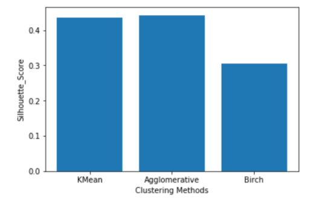

# Clustering-Algorithms-Project

In this Project I have used different Clustering Algorithms to predict the difficulty level a particular subject for a particular student on the basis of marks that student got in there continious assesments and end term exam.

#### I have used 3 different clustering algorithms here : 
#### 1) KMeans which is giving silhouette_score of approx 45.
#### 2) Agglomerative Clustering which was giving silhouette_score of 47
#### 3) Clustering using BIRCH which was giving the silhouette_score of 26

### Upon this I have at last used KMeans Algorithm to predict the difficulty level of a perticular course for a perticular student.
